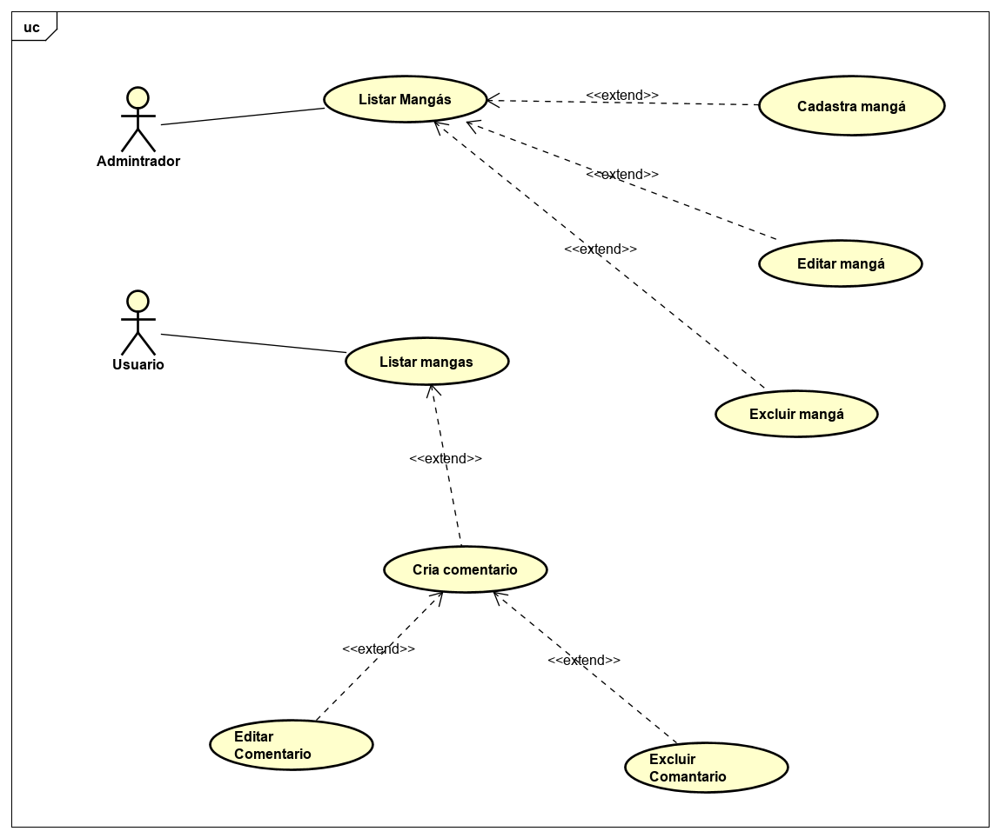

## Início

Estas instruções permitem que você obtenha uma cópia do projeto e configure
em seu computador para desenvolvimento e testes.

### Pré-requisitos

Para baixar, compilar e executar em seu computador, você deve ter:

- Sistema de controle de versões `git` ([https://www.git-scm.com/])
- Kit de Desenvolvimento `python` (3.*+) ([https://www.python.org/])
- Framework para aplicações web `django` ([https://www.djangoproject.com/])

### Instalação

##### Distribuições GNU/Linux baseadas em Debian

**Importante**: É aconselhável fazer um _update_ do `apt-get`:

```sh
sudo apt-get update
```

- git

```sh
sudo apt-get install git
```

- python

```sh
sudo apt-get install python3
```

**Importante**: é preciso que o pip esteja instalado, que é um gerenciador de pacotes Python. É por ele que instalaremos o Django.
```sh
curl https://bootstrap.pypa.io/get-pip.py -o get-pip.py
python get-pip.py
```

É aconselhável fazer um _upgrade_ dele:

```sh
python3 -m pip install --upgrade pip
```

- django 

```sh
pip install Django
```

### Clonar o repositório

Para realizar um clone do projeto, execute através do terminal ou cmd:

```sh
git clone https://gitlab.devops.ifrn.edu.br/20172014040008/p.git
```

**Observação**: o comando acima clona o repositório através do protocolo HTTPS e exige que você digite suas credenciais da plataforma de hospedagem de códigos que você está utilizando (neste caso, o GitLab).
- Se você preferir e já ter colocado a chave pública SSH da sua máquina na lista de aceitação de requisições SSH, poderá clonar com o comando ```git clone git@gitlab.devops.ifrn.edu.br:20172014040008/p.git```. Através deste método, a requisição não pede senha e a comunicação se torna mais segura.

O clone do git cria um diretório chamado `g-horarios` se não for informado um
nome de diretório.

### Viajar até o repositório criado
Para entrar no diretório recém-criado, ainda no terminal ou no cmd digite
```sh
cd g-horarios
```

### Criar o banco de dados
Para rodar o script que cria o banco de dados, assumindo que você esteja dentro do diretório principal da aplicação, rode no terminal ou cmd:
```sh
python3 src/projeto/manage.py migrate
```
### Opcional: criar um usuário para a interface administrativa
Até o momento, o banco de dados deve estar vazio. Para adicionar dados a ele, uma alternativa é criar um usuário para a interface administrativa. Rode no terminal ou cmd:
```sh
python3 src/projeto/manage.py createsuperuser
```

### Executar em modo desenvolvimento

Para executar em modo de desenvolvimento, no terminal ou no cmd, rode:

```sh
python3 src/projeto/manage.py runserver
```

## Documentação


## Equipe de desenvolvimento

* **Wallase Alan Costa de Morais** - *wallacealanmorais@gmail.com* 
